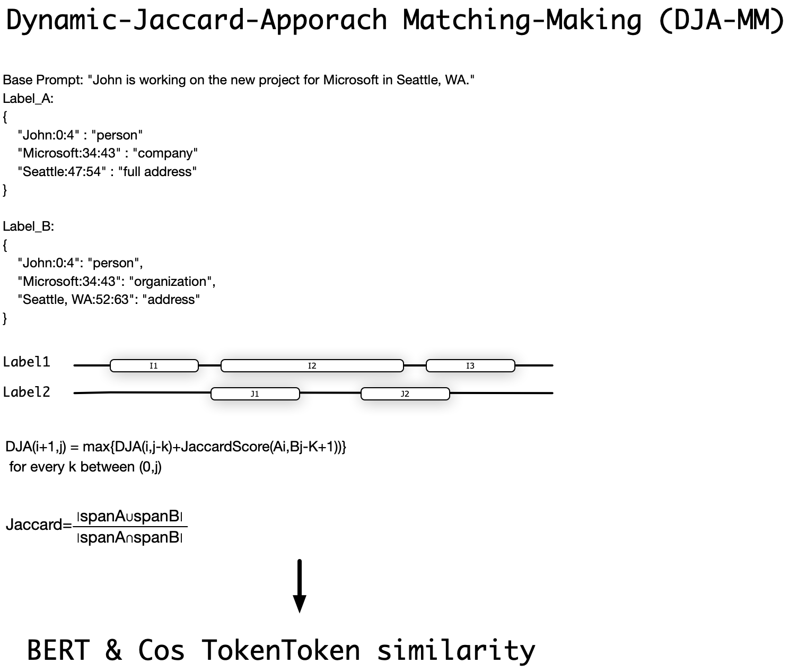

# DMBertA EVAL
# An Evaluation framework that evaluates NER models on their performance on Sensitive Topic information detection.

DMBertA Evaluation Framework uses DMBertA (Dynamic-Jaccard-Mactchmaking Bert approach) at its core to caculate the NER (naming entity recognition) performance.


DMBertA, ethan@linq.ai @2019, is a algorithm proposed for efficiently and effectively calculating distance between two label KV pair clusters, which is usually the end result of NER models.

For example the best possible distance between Label_A and Label_B below.
```
Base Prompt: "John is working on the new project for Microsoft in Seattle, WA."

Label_A: 
{ 
    "John:0:4" : "person"
    "Microsoft:34:43" : "company"
    "Seattle:47:54" : "full address"
}

Label_B:
{
    "John:0:4": "person",
    "Microsoft:34:43": "organization",
    "Seattle, WA:52:63": "address"
}
```

The Eval works as follows. Firstly, BERT based NER model detects PII (Personal Identifiable Information) from a given prompt, such as Address, Name, and SocialSecurityNumber

This model calls huggingface NER models against a local evalbase. Then using a higher level model (Open AI GPT4o/claude sonnet 3.5/Gemini 1.5 Pro) as auto-rater
for the evaluation policy (ground truth)

During evaluation, for each of eval cases, on each of {ground truth, label candidate} pair, we run the following DMBertA algorith to calculate the DMBertA Score.

First each matching item, as problem Breakdown, we have two lists: 

1, A = [A1, A2, …, Ai] and B = [B1, B2, …, Bj].
2, Each pair (Ai, Bj) has an associated score score(Ai, Bj).

We want to define a DJA(Dynamic Jaccard Apporach) table, DJA(i, j), which represents the highest score achievable by selecting pairs from the first i items of A and the first j items of B.
```
DJA(i+1,j) = max{DJA(i,j-k)+JaccardScore(Ai,Bj-K+1))}
 for every k between (0,j)
```

Once the matching is decided from the previous approach, we use BERT based tokenlization to calculate similarity.

We choose basic Bert to tokenize the label
```
tokenizer = BertTokenizer.from_pretrained('bert-base-uncased')
model = BertModel.from_pretrained('bert-base-uncased')
```
and use cosine_similarity to get the final score.


Above step is illustrated as:



# Deployment QuickStart
#note1: CMakeLists.txt shows the dependency needed
#note2: CMakeLists.txt read from ${VCPKG_ROOT}

vcpgk_root and vcpkg need to install
nlohmann/json.hpp

```
export VCPKG_ROOT=~/vcpkg
vcpkg install nlohmann-json
```

sudo apt-get install libcurl4-openssl-dev

To Reset
```
rm -rf CMakeCache.txt build/
mkdir build
cd build
```


To execute
```
cd build/

# this step is for load vcpkgs
cmake -DCMAKE_TOOLCHAIN_FILE=/Users/ethw/vcpkg/scripts/buildsystems/vcpkg.cmake -DCMAKE_VERBOSE_MAKEFILE=ON ..

make

../evaluation_service
```

Example out put comparison of models
```
Prompt: Driver's license number D1234567 was issued to Emily Brown.
Labels:
  D1234567:23:31 : driver licence
  Emily Brown:46:57 : person
Score: 0.9
GEP return 0.5
GEP return 0.5
GEP return 0.5
  | - Inference Response [Gliner]:  
{
    "D1234567:24:32": "driver's license number",
    "Emily Brown:47:58": "person"
}
  | - Inference Response [Deberta]:  
{
    " D1234567:23:32": "pin",
    " Emily Brown.:46:59": "fullname"
}
  | - Inference Response [Spacy]:  
{
    "Driver:0:6": "org",
    "Emily Brown:47:58": "person"
}
Model: Deberta, Accumulate Score: 2.6
Model: Gliner, Accumulate Score: 3
Model: Spacy, Accumulate Score: 1.95
```

